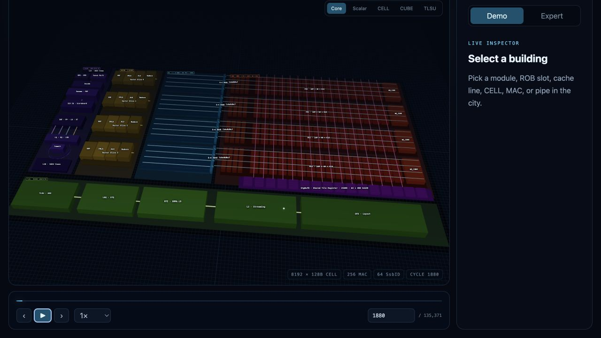
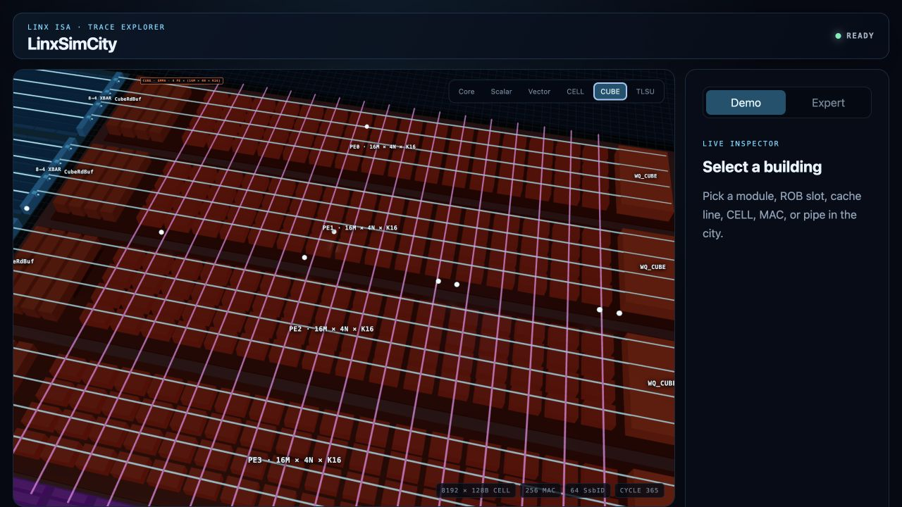
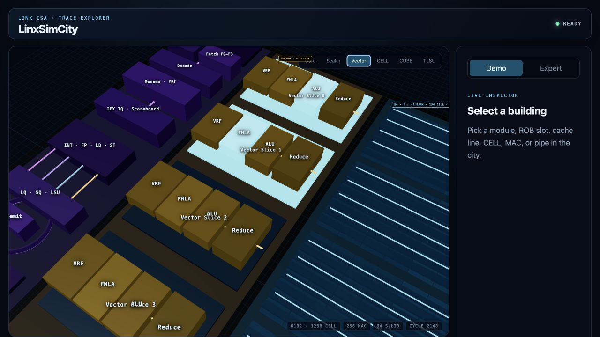

# SuperNPUBench showcase

The showcase connects the trace-enabled `LinxISA/SuperScalarModel` directly to LinxSimCity. It produces browser-ready `.linxtrace` archives from official SuperNPUBench ELFs; no synthetic event conversion sits between the model and the viewer.

## Workloads

| Workload       | ELF                                                       | Completion policy      | Verified reference trace                    |
| -------------- | --------------------------------------------------------- | ---------------------- | ------------------------------------------- |
| Matmul         | `matmul_MASK_MASK_FP32_M256_N256_K256_tM32_tN32_tK32.elf` | Full program           | 2,170,369 events, 135,323 cycles, 34 chunks |
| FlashAttention | `sfa_Sq256_Skv512_Tm16_Tk32.elf`                          | First 250 model blocks | 124,455 events, 8,987 cycles, 3 chunks      |

The reference matmul trace exercises the visual data plane at useful scale: 405,248 Crossbar requests and grants, 225,280 128-byte CELL writes, 179,968 CELL reads, 270,336 pipe transfers, and 112,640 CUBE completions. The bounded FA trace additionally covers vector dispatch, stage, completion, and writeback events.

## Prerequisites

- Node.js 22.12 or newer
- A LinxSimCity checkout with `npm install` completed
- A SuperScalarModel checkout containing the LinxSimCity adapter
- An official SuperNPUBench tree whose root contains `kernel/matmul` and `kernel/fa`

Build SuperScalarModel with the adapter enabled:

```sh
cmake -S /path/to/SuperScalarModel \
  -B /path/to/SuperScalarModel/build-linxsimcity \
  -DCMAKE_BUILD_TYPE=Release \
  -DBUILD_TESTING=ON \
  -DENABLE_LINXSIMCITY_TRACE=ON \
  -DLINXSIMCITY_SDK_DIR=/path/to/LinxSimCity/sdk/cpp
cmake --build /path/to/SuperScalarModel/build-linxsimcity --parallel
```

## Generate and validate

Choose a new output directory. The generator deliberately refuses to overwrite an existing trace, archive, or model log.

```sh
cd /path/to/LinxSimCity
npm run showcase:generate -- \
  --model /path/to/SuperScalarModel \
  --bench /path/to/supernpubench-root \
  --output /path/to/showcase-output
```

The output contains:

- `matmul.trace-dir/` and `fa-250-blocks.trace-dir/`: inspectable logical bundles
- `supernpubench-matmul.linxtrace` and `supernpubench-fa-250-blocks.linxtrace`: viewer inputs
- one `gfsim` log per workload
- `provenance.json`: source revisions, ELF hashes, archive hashes, completion policy, and known limitations

The generator always enables the `pipeline` profile, uses the four-PE configuration, increases the deadlock watchdog to 100,000 cycles for long legal stalls, validates each directory, packs it, and validates the archive independently.

## Open in the WebGL viewer

The verified FA-250 archive is bundled as the default public demo at <https://linxisa.github.io/LinxSimCity/>. The hosted Viewer loads it at cycle 49 and begins playback at 1× without requiring a file picker. The 250-block boundary remains explicit: this is a truthful bounded model trace, not a full-program FlashAttention claim.

```sh
npm run dev --workspace @linxsimcity/viewer
```

Open the printed local URL to run the bundled FA trace, or choose **Open local trace** to load either generated archive. The city is intentionally rectangular:

- The left district is a scalar CPU with IFU, rename, issue/execute pipes, caches, and a ring-shaped ROB.
- The center Tile Register is flattened into individually addressable 128-byte cells, so each model read or write can highlight the exact cell.
- Four long CUBE PE strips align with one quarter of the Tile Register each. A flows horizontally from four BG banks; B broadcasts vertically from StgBufB, which is the Shared Tile Register below the matrix.
- Crossbar and dataflow links are orthogonal 3D pipes rather than curved wires.

## Reference captures

The following captures come from the validated archives above, rendered by the production Viewer build.

### Complete city · matmul cycle 1880



### CUBE pipeline · matmul cycle 365

At this cycle, the official trace contains simultaneous `cube.stage` and `cube.complete` events. The close-up shows four long PE strips, individually addressable MAC cells, horizontal A pipes, vertical B broadcast pipes, CubeRdBuf, and WQ_CUBE.



### Vector pipeline · FA cycle 2148

The FA trace drives PE0 ALU and PE1 FMLA stages at this cycle. The Vector camera preset exposes the corresponding trace-driven cyan highlights next to the scalar CPU and flattened CELL banks.



## FlashAttention boundary

The FA archive is a truthful bounded trace, not a claimed full-program result. Beyond the selected boundary, the current SuperScalarModel can publish a newer local BIFU fragment before the tail of an older fragment on another thread. That can close a `TSTORE` block before its canonical `B.IOT`/`B.IOR` metadata arrives. LinxSimCity records the 250-block limit in provenance so this incomplete model suffix is never presented as a valid complete workload.

The matmul workload does not hit that defect and runs to normal program completion.
