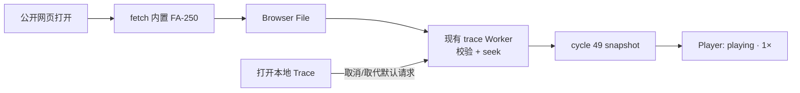

# 默认 FA Trace 与公开网页设计

状态：书面规格待最终审阅

日期：2026-08-13

目标仓库：`LinxISA/LinxSimCity`

## 1. 目标

LinxSimCity 提供一个无需安装、无需手动选择文件即可观看的公开演示：访问
`https://linxisa.github.io/LinxSimCity/` 后，Viewer 自动加载仓库内置的官方
SuperNPUBench FA-250 trace，并从首个有效周期开始以 1× 速度播放。

该功能沿用 Gem5SimCity 的“示例 trace 随 Viewer 一起分发、克隆后开箱即看”组织方式，
但不复制其代码或视觉资产。LinxSimCity 继续使用自己的 `.linxtrace` contract、Web Worker
加载路径、WebGL 城市和 Linx Core/CUBE 拓扑。

## 2. 交付范围

本次交付包括：

- 将现有 `supernpubench-fa-250-blocks.linxtrace` 作为版本化静态资源加入 Viewer；
- 页面首次打开时自动请求、校验和加载该 trace；
- 加载成功后定位到 manifest 的首个有效周期（当前为 cycle 49）并自动进入 `playing`；
- 页面始终保留“打开本地 Trace”入口，用户选择本地文件后停止默认 trace 并切换数据源；
- 为 Vite 配置 GitHub Pages 子路径 `/LinxSimCity/`；
- 增加 GitHub Actions Pages workflow，在 `main` 更新时发布，也允许手动触发；
- 在 README 顶部加入在线演示链接，并说明默认 workload、trace 边界和本地加载方式。

本次不增加服务端、遥测、登录、远程 trace 列表或外部对象存储。FA-250 的生成器和
SuperScalarModel hook 也不在本次变更范围内。

## 3. 方案选择

采用 GitHub Pages + GitHub Actions，并把默认 trace 与静态站点一起发布。

未采用以下方案：

- 手工维护 `gh-pages` 分支：构建产物容易与源码版本漂移；
- 外部 CDN 或对象存储：增加 CORS、网络可用性和版本一致性风险；
- 浏览器内生成 synthetic FA：不能代表已验证的真实模型 workload。

内置约 1.8 MB 的 FA-250 archive 可接受，因为它换取了确定、无跨域依赖且可离线复现的
演示体验。

## 4. 组件与职责

### 4.1 默认 trace 资源

静态资源路径固定为：

```text
apps/viewer/public/traces/supernpubench-fa-250-blocks.linxtrace
```

Viewer 通过 Vite 的 `BASE_URL` 解析资源地址，不能硬编码站点根路径。这样同一构建既可在
本地 `/` 运行，也可部署到 `/LinxSimCity/`。

资源必须保持现有 archive 内容和校验结果：124,455 events、8,987 cycles、3 chunks，
cycle 范围 49–9035，SHA-256 为
`2d2001de4b1b00e3dade9a8d4e77f5f9915f235798fbbd8b5db1074e65572fa0`。构建或测试不得在
静态资源上做二次转换。

### 4.2 启动协调器

增加一个职责单一的默认 trace 启动协调器：

1. 应用挂载后请求静态 archive；
2. 将响应包装为浏览器 `File`，复用现有 `loadTrace` Worker 路径；
3. 等待加载和首周期 seek 成功；
4. 仅在默认加载仍是当前请求时调用 `play()`。

协调器不得复制 bundle 解析逻辑。解析、schema 校验、checkpoint seek 和 snapshot 构建仍由
现有 trace runtime 与 Worker 完成。

开发模式中的 React Strict Mode、组件重挂载或重复 effect 不得发起两个并行默认加载。
协调器需要显式的单次启动和取消语义。

### 4.3 本地 trace 切换

默认 trace 加载后，原先仅在空状态显示的 dropzone 不再是唯一入口。Viewer shell 提供一个
持续可见的“打开本地 Trace”按钮，触发隐藏的文件选择器并复用现有 `loadFile`。

本地文件选择优先于默认加载：

- 若默认请求尚未完成，取消或忽略其迟到结果；
- 若默认 trace 正在播放，先切换到 loading，再由现有 store 替换 snapshot；
- 本地 trace 加载成功后不强制自动播放，保持现有本地文件行为，避免用户在检查文件时意外运行。

### 4.4 公开发布

新增 GitHub Pages workflow：

- 触发：`main` push 和 `workflow_dispatch`；
- 权限：最小化为读取源码、写 Pages、签发部署身份令牌；
- 构建：使用仓库锁定的 Node/npm 版本路径，执行干净安装、检查和 Viewer production build；
- 上传：只上传 `apps/viewer/dist`；
- 部署：使用 GitHub 官方 Pages Actions；
- 并发：同一 Pages 环境只保留最新部署，不允许旧提交覆盖新提交。

Vite production build 的 base 为 `/LinxSimCity/`。本地开发和 preview 仍能使用 `/`，测试通过
注入的 base 验证路径拼接，不依赖 GitHub 网络。

## 5. 数据流与状态



状态规则：

- `idle → loading → ready → playing` 是默认 trace 的成功路径；
- `play()` 只能发生在默认 `loadTrace()` 成功之后，不能依赖固定延时；
- 用户暂停、seek 或选择本地文件后，默认启动逻辑不得再次把播放器切回 `playing`；
- 刷新页面视为新的演示会话，重新从首周期自动播放。

## 6. 错误处理

默认资源请求失败、HTTP 非成功响应、archive 校验失败或 Worker 加载失败时：

- 不进入播放状态；
- 复用 Viewer 现有诊断面板展示可操作错误；
- 保持“打开本地 Trace”入口可用；
- 提供“重试默认演示”动作；
- 不用 synthetic 数据静默替代官方 trace。

GitHub Pages 上的资源 URL 必须由部署后的 base-path 冒烟测试验证，避免网站 shell 可打开但
trace 返回 404。

## 7. 测试与验收

### 7.1 自动化测试

- 单元测试：默认资源 URL 使用 `BASE_URL`，且只发起一次加载；
- 状态测试：`loadTrace` 成功后调用 `play()`，失败时不调用；
- 竞态测试：本地文件选择或用户交互使迟到的默认加载失效；
- UI 测试：已有 snapshot 时仍可找到并使用“打开本地 Trace”；
- 构建测试：production base 为 `/LinxSimCity/`，生成资源包含默认 archive；
- workflow 静态检查：Pages 权限、artifact 路径、触发条件和并发配置符合设计。

### 7.2 发布验收

对 `https://linxisa.github.io/LinxSimCity/` 做一次真实浏览器冒烟：

1. 页面和 WebGL scene 无控制台错误；
2. 默认 archive 请求返回成功；
3. Viewer 显示 FA-250 元数据；
4. 播放器无需点击即处于 `PLAYING · 1×`；
5. cycle 从 49 向前推进，城市中的 pipeline/CELL/CUBE 活动随 trace 更新；
6. 暂停、seek、恢复和打开本地 trace 均可用；
7. 刷新后重新执行默认演示路径。

## 8. 完成条件

只有在以下条件同时成立时才视为完成：

- 默认 FA-250 的自动加载与自动播放通过测试；
- 本地 trace 工作流未回归；
- `npm run check` 和 production build 通过；
- Pages workflow 成功部署；
- 公开 URL 的真实浏览器验收通过；
- README 中的演示 URL、默认 trace 来源和已知 250-block 边界与实际部署一致。
