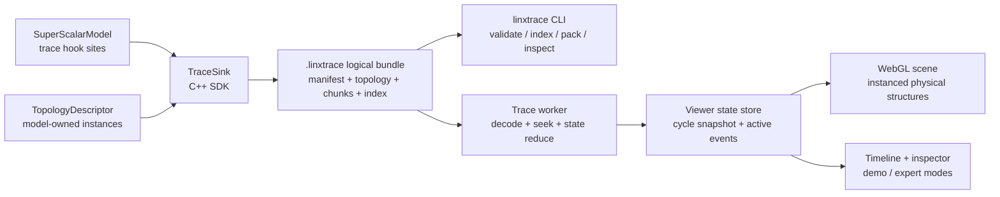

# LinxSimCity 设计规格

状态：书面规格待最终审阅  
日期：2026-08-13  
目标仓库：`LinxISA/LinxSimCity`

## 1. 产品目标

LinxSimCity 是面向 LinxCoreModel / SuperScalarModel 的 WebGL trace 可视化工具。它把处理器和矩阵计算核心映射为可交互的三维芯片城市，使用户能够在周期级 trace 上观察：

- 标量前端、乱序流水线、执行 Pipe、Cache、ROB 和 Commit；
- Vector Slice、BG/CELL Register、Crossbar、CUBE/GMMA 和 TLSU；
- 指令、CELL、Cache line、队列槽位和数据 pipe 的周期级状态变化；
- stall、flush、bank conflict、cache miss、queue full、issue 和 writeback 等性能事件。

首版同时服务两个使用场景：

1. **Demo 模式**：无需了解模型内部结构即可播放示例 trace，观察城市随周期运行。
2. **Expert 模式**：显示物理实例 ID、端口、bank、queue slot、pipeline stage、stall reason 和事件详情。

## 2. 设计边界

### 2.1 首版范围

- 创建独立的 `LinxISA/LinxSimCity` 仓库。
- 提供版本化 Trace Schema、Topology Descriptor 和 C++ Trace Writer SDK。
- 提供 CLI，用于校验、索引、打包和检查离线 trace。
- 提供基于 WebGL 的浏览器 viewer，离线加载 trace 后完成播放、暂停和任意周期跳转。
- 提供 SuperScalarModel 集成适配层和示例接线说明。
- 提供内置 synthetic trace，使 viewer 不依赖模型即可开发、测试和演示。
- 支持约 100,000 cycles、1–5 million events 的 trace。

### 2.2 非目标

- 首版不修改或控制模型执行状态；LinxSimCity 是只读观察工具。
- 首版不要求实时流式连接模型；模型先输出离线 trace，viewer 再加载。
- 首版不提供多人协作、云端存储或服务端数据库。
- 首版不尝试展示未被 SuperScalarModel 实现或文档定义的虚构微流水线。
- 首版不把主城区外框做成用户可编辑 floorplan。

## 3. 参考实现与事实来源

### 3.1 Gem5SimCity

Gem5SimCity 的以下组织方式直接复用：

- O3 CPU floorplan：I-Cache / BPU / Fetch / Decode / Rename / IQ / LQ / SQ / execution lanes / ROB / Commit / RegFile / Scoreboard / D-Cache。
- 每个 Cache line 使用一个可独立变色的 `InstancedMesh` cell。
- ROB 是带独立槽位的实体环；执行单元是圆管形 Pipe。
- trace 事件通过稳定的物理实例索引映射到 cell、queue slot 和 pipeline lane。

参考：

- <https://github.com/Entropy-xcy/Gem5SimCity/blob/6c7e0b4ab7ed7b58fdb70527d9ee182db1956483/web/src/layout.js>
- <https://github.com/Entropy-xcy/Gem5SimCity/blob/6c7e0b4ab7ed7b58fdb70527d9ee182db1956483/web/src/scene/Structures.jsx>
- <https://github.com/Entropy-xcy/Gem5SimCity/blob/6c7e0b4ab7ed7b58fdb70527d9ee182db1956483/web/src/scene/Buildings.jsx>

### 3.2 SuperScalarModel

物理容量和模块命名以当前 SuperScalarModel 实现和配置为准：

- CELL Register：每个 PE `8 banks × 256 rows × 128B = 256KB`，四个 PE 合计 8192 个 128B CELL。
- CUBE 每周期读取一个连续的 4-bank group，即 `{B0–B3}` 或 `{B4–B7}`，总宽度 512B。
- L1I：128 sets × 8 ways × 64B，共 1024 line cells。
- L1D：256 sets × 4 ways × 64B，共 1024 line cells。
- 当前 SPEROB 深度：128 entries；decode、rename 和 retire 宽度均为 4。
- CUBE/GMMA 使用 DaVinciOO v5 的 BG / StgBufB / GMMA 结构，不使用旧 outerCube。

参考文件：

- `SuperScalarModel/modelSpec/cell_register_as.md`
- `SuperScalarModel/configs/cell.toml`
- `SuperScalarModel/configs/ifu.toml`
- `SuperScalarModel/configs/l1.toml`
- `SuperScalarModel/configs/spe.toml`
- `SuperScalarModel/modelSpec/superscalar_model_top_framework.md`

## 4. 总体架构

采用 contract-first hybrid 架构：模型负责发出语义正确的结构和事件，viewer 负责校验、索引、状态还原和渲染。



### 4.1 仓库职责

`LinxSimCity` 仓库拥有：

- Trace Schema 和兼容性规则；
- Topology Descriptor 类型；
- C++ writer SDK；
- trace CLI、浏览器 reader、indexer 和 reducer；
- WebGL scene、UI、示例 trace、测试和文档。

`SuperScalarModel` 仓库拥有：

- 模块内部 trace hook 的位置和语义；
- 从模型实例构建 Topology Descriptor 的逻辑；
- 模型对象到稳定 `entity_id` 的映射；
- profile 开关和事件采样策略；
- 对 LinxSimCity C++ writer SDK 的构建接入。

### 4.2 建议仓库结构

```text
LinxSimCity/
├── apps/
│   └── viewer/                 # 浏览器入口、应用 shell、timeline 和 inspector
├── packages/
│   ├── trace-schema/           # TypeScript schema、JSON Schema、兼容性检查
│   ├── trace-runtime/          # chunk reader、index、seek、state reducer、Web Worker
│   ├── topology/               # Topology Descriptor、稳定 ID 和布局解析
│   ├── scene-core/             # Three.js scene、camera、picking、LOD、animation loop
│   └── scene-modules/          # Scalar、Cache、ROB、CELL、Crossbar、CUBE、TLSU
├── sdk/
│   └── cpp/                    # TraceSink、bundle writer、事件编码和 CMake target
├── tools/
│   └── linxtrace/              # validate、index、pack、inspect、fixture 命令
├── fixtures/
│   ├── synthetic/              # 小型确定性 trace
│   └── malformed/              # 错误处理 fixtures
├── tests/
│   ├── contract/               # C++/TS 跨语言兼容测试
│   ├── performance/            # 大 trace seek 和帧率测试
│   └── visual/                 # Playwright 交互与截图测试
└── docs/
    ├── architecture/
    ├── trace-format/
    └── superpowers/
```

每个 package 只承担一种职责；scene module 不解析 trace 文件，trace runtime 不依赖 Three.js。

## 5. Trace Contract

### 5.1 逻辑 bundle

`.linxtrace` 使用同一套逻辑目录结构。开发时可直接保存为目录；分发时使用标准 ZIP 单文件容器，保留相同的内部路径。已经 gzip 压缩的 chunk 在 ZIP 中使用 store method，避免二次压缩并支持按 entry 读取：

```text
trace.linxtrace/
├── manifest.json
├── topology.json
├── strings.json
├── index.json
└── chunks/
    ├── 000000.jsonl.gz
    ├── 000001.jsonl.gz
    └── ...
```

- `manifest.json`：格式版本、模型版本、cycle 范围、profile、计数和 chunk 参数。
- `topology.json`：模块、物理实例、父子关系、端口和稳定 ID。
- `strings.json`：opcode、stage、stall reason 等重复字符串字典。
- `index.json`：每个 chunk 的 cycle 范围、事件数、压缩大小、SHA-256 和 checkpoint 信息。
- `chunks/*.jsonl.gz`：按 cycle 范围分块的事件流。

首版默认 chunk 大小为 4096 cycles。CLI 必须允许调整，但 bundle 中必须记录实际值。

### 5.2 Event Envelope

每个事件包含以下稳定字段：

```json
{
  "cycle": 42816,
  "seq": 17,
  "type": "cell.read",
  "scope": "pe2",
  "entity_id": "pe2.bg.bank5.row23",
  "payload": {
    "request_id": 9914,
    "source": "cube",
    "bytes": 128,
    "result": "grant"
  }
}
```

约束：

- `(cycle, seq)` 在单个 trace 中严格递增。
- `entity_id` 必须在 `topology.json` 中存在。
- 未识别的可选 payload 字段可以忽略；未识别的 event type 按 manifest 的兼容性策略处理。
- schema major 版本不兼容时拒绝加载；minor 版本新增可选字段时向后兼容。
- writer 不输出 UI 坐标动画；它只输出硬件语义和必要的物理 topology。

### 5.3 Topology Descriptor

每个 topology entity 至少包含：

```ts
interface TopologyEntity {
  id: string;
  kind: string;
  parentId?: string;
  label: string;
  instance: Record<string, number | string>;
  capacity?: number;
  ports?: Array<{ id: string; direction: "in" | "out" | "inout"; widthBytes?: number }>;
  placement?: { district: string; order?: number; row?: number; column?: number };
  attributes?: Record<string, number | string | boolean>;
}
```

`placement` 描述结构关系和稳定的城区归属，不要求模型提供 Three.js 世界坐标。具体内部坐标由 scene module 计算，因此联调时可以调整子模块 placement，而不改变 trace contract。

### 5.4 Trace Profiles

三种 profile 使用同一 schema：

1. `overview`：模块 busy/idle、queue occupancy、cache summary、主要 stall 和吞吐。
2. `pipeline`：增加 instruction stage、issue、ROB、pipe、Cache line、CELL 和 crossbar 事件。
3. `forensic`：增加请求 ID、依赖、bank arbitration、replay/flush 原因和细粒度 payload。

viewer 必须根据 manifest 中的 profile 隐藏缺失功能，不能把“没有采集”显示成“硬件没有活动”。

### 5.5 首版事件类别

- `instruction.fetch/decode/rename/dispatch/issue/complete/retire/squash`
- `pipeline.enter/leave/stall`
- `queue.allocate/release/occupancy/full`
- `rob.allocate/head/tail/retire/flush`
- `register.read/write/ready`
- `cache.access/hit/miss/fill/writeback`
- `cell.read/write/grant/conflict`
- `crossbar.request/grant`
- `cube.dispatch/stage/complete/writeback`
- `vector.dispatch/stage/complete/writeback`
- `memory.request/response`
- `pipe.transfer`
- `flush.begin/end`
- `marker.user`

## 6. 三维城市拓扑

### 6.1 稳定外框

整体 Core 是横向长方形。以下城区的边界、相对顺序和主数据流方向固定：

1. 左侧：Scalar CPU。
2. 中左：Vector。
3. 中央：四个 PE-local BG / CELL Register。
4. 右侧：CUBE / GMMA。
5. CUBE 下方：StgBufB / Shared Tile Register。
6. 全宽下方：TLSU / Memory subsystem。

联调允许调整：

- 城区内部楼房的精确坐标、间距和高度；
- label、camera preset 和 LOD 阈值；
- 子模块 pipe 的局部锚点；
- 不改变语义的视觉压缩和折叠方式。

联调不允许调整：

- 外层城区顺序；
- A 横向、B 纵向的主数据方向；
- 四个 CUBE PE 与四个 BG quarter 的对齐；
- StgBufB 位于 GMMA 下方；
- Scalar CPU 保持独立完整 CPU floorplan。

### 6.2 Scalar CPU

左侧按 Gem5SimCity floorplan 旋转、缩放后嵌入固定 Scalar district：

```text
L1I / BPU
    ↓
Fetch → Decode → Rename → IEX IQ
                   ↘ PRF / Scoreboard
IEX IQ → INT/FP/LOAD/STORE pipes → SPEROB ring → Commit
                         ↘ LQ/SQ ↔ L1D
```

要求：

- IFU、BPU、Fetch、Decode、Rename、PRF、Scoreboard、各 IQ、LQ/SQ、执行 Pipe、SPEROB、Commit、L1I 和 L1D 都是独立可选实体。
- SPEROB 是 128 个物理槽位组成的环，每个槽位可独立显示 allocated、ready、head、tail、retire 和 flushed 状态。
- L1I 和 L1D 各使用 1024 个 `InstancedMesh` line cell；hit 为绿色，miss 为红色，write/fill 为青色。
- 执行单元使用 3D 圆管；instruction token 在管内移动，不使用平面箭头替代。
- 所有模块连接使用直管和必要的 90° 转角，不使用曲线绕线。

### 6.3 BG / CELL Register

四个 PE 各占一个与 CUBE PE 对齐的 quarter：

- 每个 quarter：8 banks。
- 每个 bank：256 个 128B CELL。
- 每个 quarter：2048 CELL，256KB。
- 全部四个 quarter：8192 CELL，1MB。

每个 bank 的 256 CELL 在视觉中折叠为 32 × 8 网格，所有 CELL 仍是独立实例。hover 必须显示：

- PE ID；
- bank ID；
- row；
- physical CELL ID；
- byte range；
- 当前读写、grant、conflict 状态。

每个 quarter 右侧放置一个 8→4 Crossbar。Crossbar 从 `{B0–B3}` 或 `{B4–B7}` 中选择一组，输出四条 128B A lane，继续以直管向右进入对应 CUBE PE。

### 6.4 CUBE / GMMA

- CUBE 由 4 个横向长条 PE 组成，并与四个 BG quarter 一一对齐。
- 每个 PE 显示 `16M × 4N × 16K`。
- 视觉矩阵显示 16 个 M column × 4 个 N lane；K=16 是 cell 内部 dot depth，不虚构内部 K routing。
- A 从左侧四个 BG bank lane 横向进入 `CubeRdBuf` 和 MAC matrix。
- B 从下方 StgBufB 纵向广播，穿过四个 PE。
- C 结果通过 WQ_CUBE 直回本地 BG。
- CUBE 右边界与 TLSU 右边界对齐，整个城区保持宽扁比例。

### 6.5 StgBufB

- 标题使用 `StgBufB / Shared Tile Register`。
- 位于 CUBE matrix 下方。
- 容量 256KB，显示 64 个 4KB SsbID subspace。
- 只承担 GMMA B staging 语义，不画成旧 outerCube 的通用 Input/Output/Weight Buffer。

### 6.6 TLSU / Memory

底部城区包含 TLSU/AGU、LDQ/STQ、MTE/GMMA.LD、L2/Streaming Cache、SFU/Layout。TLSU 与 CELL Register、StgBufB 和 L2 的连接使用直管；不从 TLSU 绕过 BG/StgBufB 直接连接 MAC。

## 7. Viewer 交互

### 7.1 基础控制

- 播放、暂停、单周期前进/后退；
- timeline 拖动和 cycle 输入跳转；
- 播放速度选择；
- camera presets：全城、Scalar CPU、CELL Banks、CUBE/GMMA、TLSU；
- hover 临时详情；click 固定选择；再次点击空白取消；
- trace 文件加载、最近错误提示和 profile 信息。

### 7.2 Demo 与 Expert

Demo 默认展示：

- 模块活动颜色；
- instruction/data token；
- queue、Cache、CELL 的主要状态；
- 简洁的当前 cycle 和关键事件。

Expert 增加：

- entity ID、instance index、bank/row/set/way；
- pipeline stage、request ID、依赖和 stall reason；
- 当前周期的原始事件列表；
- topology 属性、端口和带宽；
- trace profile、schema 版本和模型 commit。

### 7.3 颜色语义

- cyan：read、transfer、normal active；
- red：write、miss、flush 或错误；
- green：hit、completion、writeback success；
- amber：conflict、stall、backpressure；
- purple：B broadcast、ROB speculative state、group/shared flow；
- dim neutral：idle/free。

颜色必须同时配合 label、形状或状态文本，不能只依赖颜色传达语义。

## 8. 状态还原与任意跳转

viewer 不从 cycle 0 重放到目标 cycle。每个 chunk 记录入口 checkpoint 或引用最近 checkpoint，Trace Worker 按以下步骤 seek：

1. 根据 `index.json` 定位目标 chunk。
2. 读取最近 checkpoint。
3. 只重放 checkpoint 到目标 cycle 的事件。
4. 生成不可变 cycle snapshot 和 active-event list。
5. 主线程仅把变化的 instance ranges 提交给 Three.js。

状态 reducer 必须是纯函数，给定相同 topology、checkpoint 和 event 序列产生相同 snapshot。

## 9. 性能设计

目标数据集：100,000 cycles、1–5 million events。

设计约束：

- Cache、ROB、CELL、CUBE matrix 和 queue slots 使用 `InstancedMesh`。
- 动画帧只更新发生变化的 instance color/matrix，不逐帧扫描全部 8192 CELL。
- trace 解压、解析、索引和 reducer 在 Web Worker 中执行。
- chunk 按需读取；viewer 不要求一次性解压全部事件。
- camera distance 驱动 LOD：远景显示 district/occupancy，中景显示 bank/queue，近景显示 cell/slot。
- 正常桌面视图目标 60 FPS；大 trace 完成索引后，随机 seek 的交互目标为 250ms 内更新可见状态。

## 10. 错误处理

以下错误必须在加载阶段给出可定位诊断，不能只显示空场景：

- 不支持的 schema major version；
- manifest、topology、index 或 chunk 缺失；
- `(cycle, seq)` 逆序或重复；
- event 引用不存在的 `entity_id`；
- payload 不满足 event type 的 schema；
- chunk checksum 或解压失败；
- topology 容量与 instance index 越界；
- WebGL 不可用。

非致命错误使用 warning 列表，并允许用户下载 validation report。致命错误停止播放，但保留 manifest 和诊断信息供检查。

## 11. 测试策略

### 11.1 Contract 测试

- 同一 fixture 由 C++ writer 生成、TypeScript reader 解析。
- schema major/minor 兼容性矩阵。
- 每种 event type 的最小合法和非法 payload。
- topology entity ID 唯一性与引用完整性。

### 11.2 Reducer 测试

- 顺序播放与 checkpoint seek 得到相同 snapshot。
- flush、squash、ROB wraparound、queue full 和 bank conflict 的确定性 fixtures。
- Cache set/way、CELL bank/row 和 CUBE PE/M/N 的索引映射。

### 11.3 Scene 测试

- 8192 CELL、1024 L1I lines、1024 L1D lines 和 128 ROB slots 的实例数量断言。
- hover/click 返回正确物理实例。
- camera preset 和 LOD 切换。
- A 横向、B 纵向、StgBufB 位于 CUBE 下方的结构断言。

### 11.4 端到端测试

- 加载 synthetic trace，播放到指定 cycle，检查选定实体状态。
- 随机 seek 与线性播放结果比较。
- Demo/Expert 切换。
- 736px 和 360px 布局无横向溢出。
- 浏览器控制台无 error/warning。

### 11.5 性能测试

- 生成 100,000-cycle / 5-million-event fixture。
- 记录初次索引耗时、随机 seek P50/P95、峰值内存和动画帧率。
- 性能回归阈值由基线测试固定，超过阈值时 CI 失败。

## 12. 交付拆分

本产品跨越仓库基础设施、Trace Contract、WebGL renderer 和模型接线。实施时拆成四个可独立验收的计划：

1. **Repository Foundation and Trace Contract**  
   创建 GitHub repo、workspace、CI、schema、C++ writer、CLI 和 synthetic fixtures。
2. **Trace Runtime and Viewer Shell**  
   实现 bundle loader、worker、index、checkpoint seek、timeline、inspector 和 demo/expert 状态管理。
3. **Physical WebGL City**  
   实现固定城区、Scalar CPU、Cache、ROB、CELL、Crossbar、CUBE、StgBufB、TLSU、picking、LOD 和 camera presets。
4. **SuperScalarModel Integration and Performance Closure**  
   在模型中接入 TraceSink/TopologyDescriptor，完成三种 profile、真实 trace 联调、性能基线和文档。

四个计划按顺序执行；每个计划结束时都有可运行、可测试的结果。内部 placement 的进一步调整属于第三、第四计划，不改变 Trace Contract。

## 13. 验收标准

项目达到首版完成状态时必须满足：

- `LinxISA/LinxSimCity` 是独立可构建仓库，CI 通过。
- 无模型依赖时可加载 synthetic trace 并完整演示。
- SuperScalarModel 能输出通过 CLI validation 的 `.linxtrace`。
- viewer 能加载 100,000-cycle trace，播放、暂停并任意 seek。
- Scalar CPU、Vector、四个 BG quarter、四个 CUBE PE、StgBufB 和 TLSU 城区均可聚焦。
- 128B CELL、Cache line、ROB slot、CUBE MAC cell 均可独立 hover/click 和 trace 高亮。
- A 数据流横向、B 数据流纵向，所有主连接是 3D 直管。
- Demo 与 Expert 模式均可用。
- contract、unit、end-to-end、visual 和 performance tests 通过。

## 14. 已确认决策

- 使用 WebGL 真三维城市，而不是 2D 或伪 3D。
- 楼房代表模块；ROB 是实体环；Cache、CELL 和矩阵使用独立可高亮 cell。
- 主城区外框和 placement 固定，内部结构在真实 trace 联调时允许细调。
- Core 保持横向长方形。
- CUBE 使用 BG / StgBufB / GMMA，不使用 outerCube。
- 四个 CUBE PE 横向排列并与四个 BG quarter 对齐。
- A 横向、B 纵向；不增加绕线。
- StgBufB 就是 Shared Tile Register，放在矩阵下方。
- 首版使用离线 trace；TraceSink 是模型侧通用结构化接口。
- 支持 overview、pipeline、forensic 三种采集 profile。
- 架构采用 contract-first hybrid，模型与 viewer 通过版本化 contract 解耦。
